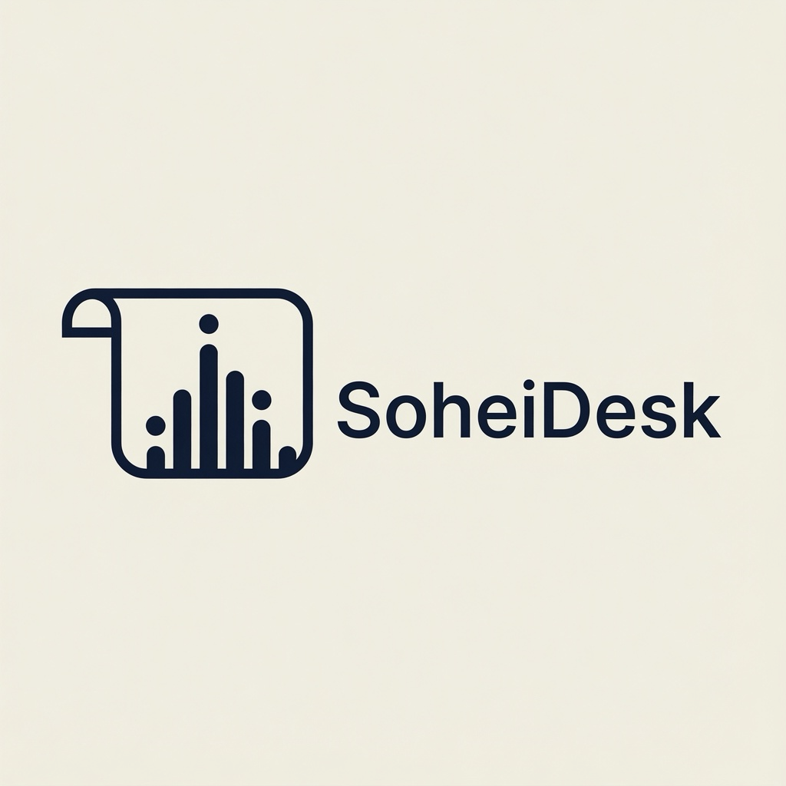
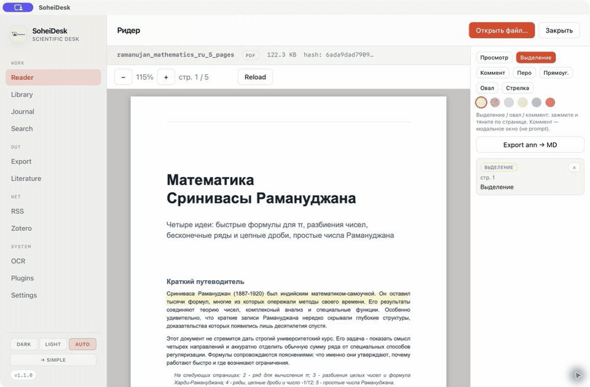
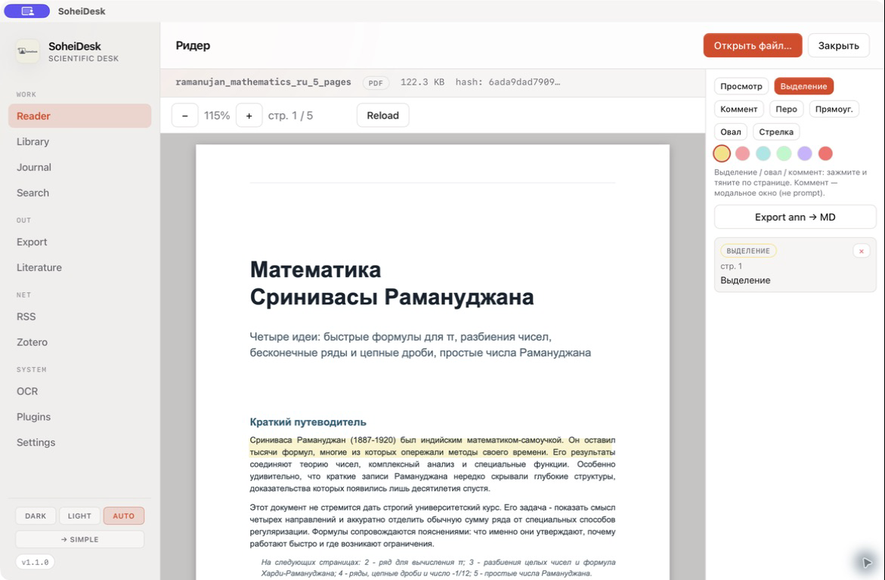
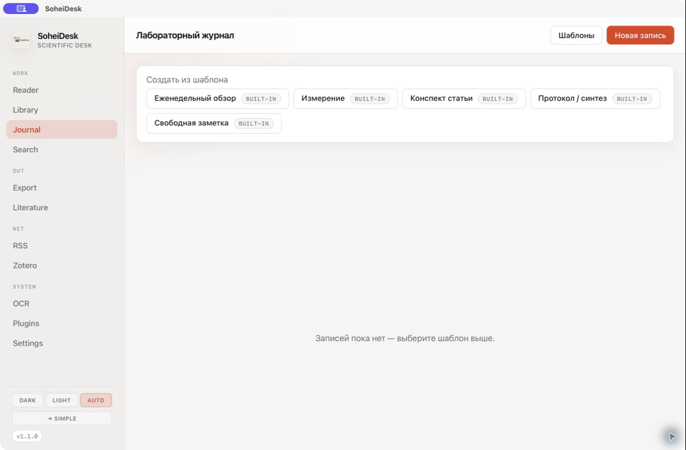

<p align="center">
  
</p>

<h1 align="center">SoheiDesk</h1>

<p align="center">
  Локальная программа для чтения научных документов, аннотаций
  и лабораторных записей.
</p>

<p align="center">
  <a href="./README.md">English</a>
  ·
  <a href="https://github.com/pinkprincess766/SoheiDesk/releases">Релизы</a>
  ·
  <a href="#сборка-из-исходников">Сборка из исходников</a>
</p>

<p align="center">
  
</p>

SoheiDesk — приложение на ранней стадии разработки для понятного рабочего
сценария: открыть статью, отметить важное, записать ход работы и экспортировать
результат. Основные данные остаются на компьютере, регистрация не нужна.

## Что работает сейчас

| Раздел | Возможности |
|--------|-------------|
| Ридер | PDF с исходной разбивкой на страницы и текстовый режим для других форматов |
| Аннотации | Выделения, комментарии, рисунки от руки, прямоугольники, овалы и стрелки |
| Журнал | Встроенные и пользовательские шаблоны, вложения, предпросмотр и экспорт |
| Защита черновиков | Записи и шаблоны автоматически сохраняются в SQLite; восстановление выполняется явно |
| Библиотека и поиск | История локальных документов и полнотекстовый поиск по документам и журналу |
| Экспорт | Markdown, HTML, Typst, LaTeX и DOCX |
| Литература | DOI, поиск в arXiv/PubMed, экспорт библиографии и импорт Zotero только для чтения |

Обычный сценарий состоит из четырёх шагов:

1. Открыть статью в **Ридере**.
2. Добавить выделение или комментарий, не изменяя исходный файл.
3. Записать результат в **Журнале**.
4. Проверить предпросмотр и экспортировать готовую запись.

## Скриншоты

| PDF и инструменты аннотаций | Шаблоны лабораторного журнала |
|:---------------------------:|:-----------------------------:|
|  |  |

## Два режима интерфейса

**Обычный режим** показывает всё рабочее пространство: ридер, библиотеку,
журнал, поиск, экспорт, литературу, RSS, Zotero, OCR и настройки.

**Простой режим** — текстовый ридер с небольшой панелью и управлением с
клавиатуры. Он удобен, когда важнее текст документа, а не исходная вёрстка
страницы. Режим выбирается при первом запуске и меняется в настройках.

Основные сочетания клавиш в обычном режиме:

| Сочетание | Действие |
|-----------|----------|
| `⌘/Ctrl+O` | Открыть документ |
| `⌘/Ctrl+F` | Поиск |
| `⌘/Ctrl+J` | Открыть журнал |
| `⌘/Ctrl+,` | Открыть настройки |

## Установка

Готовые сборки, когда они опубликованы, находятся в
[GitHub Releases](https://github.com/pinkprincess766/SoheiDesk/releases).
Нужно скачать файл под свою систему:

- macOS: `.dmg`
- Windows: `.msi` или установочный `.exe`
- Linux: `.AppImage` или `.deb`

Сейчас приложение подписано не для всех платформ, поэтому система может
показать предупреждение о неизвестном разработчике. Если нужной сборки в
релизе нет, проект можно собрать из исходников.

## Форматы

| Формат | Как открывается |
|--------|-----------------|
| PDF | Исходные страницы через PDF.js; извлечённый текст кэшируется для поиска и простого режима |
| DOCX, EPUB, FB2, HTML, Markdown | Преобразуются в текстовый режим с переносом строк |
| TXT, TeX | Открываются как обычный текст |
| DjVu | Текст извлекается внешней командой `djvutxt` из DjVuLibre |

Для поиска по сканированным PDF сначала нужен OCR. PDF с паролем пока не
поддерживаются.

## Данные и сеть

- Документы, аннотации, записи журнала, черновики и настройки хранятся локально.
- Для основной работы не нужен аккаунт.
- Интернет используется только при явном вызове сетевой функции: DOI, arXiv,
  PubMed или RSS.
- База Zotero открывается только для чтения.
- OCR, DjVu, плагины и интеграция с ChromaTsvet могут запускать программы,
  установленные на компьютере.
- Доступ по локальной сети выключен по умолчанию и не предназначен для
  публикации в интернете.

SoheiDesk активно разрабатывается и не является сертифицированной электронной
лабораторной системой. Важные исходные документы и данные приложения стоит
включить в обычное резервное копирование.

## Сборка из исходников

Понадобятся Rust, Node.js 20 или новее и pnpm.

```bash
git clone https://github.com/pinkprincess766/SoheiDesk.git
cd SoheiDesk
pnpm install
pnpm app:dev
```

Команды проверки и сборки:

```bash
pnpm test:frontend   # регрессионные тесты фронтенда и безопасности
pnpm build           # TypeScript + production-сборка интерфейса
pnpm app:build       # установщики

cargo test --manifest-path src-tauri/Cargo.toml
cargo clippy --manifest-path src-tauri/Cargo.toml --all-targets -- -D warnings
```

Папка `src-tauri/target` во время сборки Rust может занять несколько гигабайт.
Команда `pnpm clean` удаляет сгенерированные артефакты.

## Текущие границы проекта

Сегодня SoheiDesk — локальный ридер и рабочий журнал. Семантический поиск с ИИ,
автоматические отчёты по спектрам, голосовое управление и карты знаний пока
остаются идеями, а не готовыми функциями.

## Стек

Vue 3 · TypeScript · Pinia · Tauri 2 · Rust · SQLite · PDF.js

## Лицензия

[MIT](./LICENSE)
